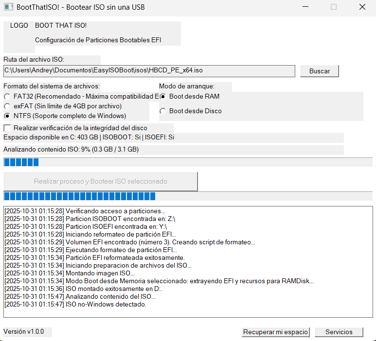

# BootThatISO!

BootThatISO! es una herramienta innovadora para Windows que permite **arrancar sistemas operativos desde archivos ISO sin necesidad de una memoria USB**. Ideal para situaciones donde no se cuenta con un dispositivo USB a mano, como en viajes, equipos prestados o emergencias. Automatiza la creación de particiones EFI y de datos en el disco interno, montaje de ISOs, copia de archivos y configuración de BCD, ofreciendo una interfaz gráfica intuitiva y soporte para ejecución no asistida.

Esta utilidad es especialmente útil para:
- **Instalaciones rápidas**: Arranque directo desde ISO para instalación de Windows, Linux o herramientas de recuperación sin preparar USB.
- **Entornos de prueba**: Prueba ISOs de sistemas operativos o utilidades sin modificar hardware externo.
- **Recuperación de sistemas**: Acceso a herramientas de reparación como HBCD_PE o entornos live sin depender de medios externos.
- **Automatización**: Integración en scripts para despliegues masivos o configuraciones automatizadas.

Proyecto desarrollado por **Andrey Rodriguez Araya**.



## Caracteristicas clave
- Crea o reforma particiones `ISOBOOT` (datos) e `ISOEFI` (EFI) en el disco del sistema, con opciones de formato FAT32, exFAT o NTFS.
- Soporta dos modos de arranque: carga completa del ISO en disco o modo RAMDisk (boot.wim en memoria).
- Detecta ISOs de Windows y ajusta automaticamente la configuracion de BCD; las ISOs no Windows arrancan directamente desde la particion EFI.
- Ejecuta comprobaciones opcionales de integridad (`chkdsk`), genera bitacoras detalladas y permite cancelar o recuperar espacio.
- Proporciona un modo no asistido para integraciones con scripts mediante argumentos de linea de comandos.
- **Mejora ISOHASHBOOT**: Optimización de eficiencia que compara el hash MD5 del archivo ISO, el modo de arranque y el formato seleccionado contra los valores almacenados en la partición existente. Si coinciden, omite el formateo y la copia de archivos, acelerando procesos repetitivos con el mismo ISO y configuración.

## ISOs Testeadas

### Modo RAM (Boot desde Memoria)
- ✅ HBCD_PE_x64.iso (ARRANQUE CORRECTO)
- ✅ Win11_25H2_Spanish_x64.iso (ARRANQUE CORRECTO)
- ✅ Windows10_22H2_X64.iso (ARRANQUE CORRECTO)

### Modo EXTRACT (Instalación Completa)
- ✅ HBCD_PE_x64.iso (hace fallback ISOBOOT_RAM)
- ✅ Win11_25H2_Spanish_x64.iso (hace fallback ISOBOOT_RAM)
- ✅ Windows10_22H2_X64.iso (hace fallback ISOBOOT_RAM)

## Requisitos
- Windows 10 u 11 de 64 bits con privilegios de administrador.
- Visual Studio 2022 (o toolset MSVC compatible) con soporte para CMake y MFC.
- Visual C++ Redistributable for Visual Studio 2022 (x64 o x86 según la arquitectura del sistema; descárgalos desde https://aka.ms/vs/17/release/vc_redist.x64.exe para x64 o https://aka.ms/vs/17/release/vc_redist.x86.exe para x86).
- PowerShell, DiskPart, bcdedit y herramientas de linea de comandos de Windows disponibles en el sistema.
- Espacio libre minimo de 12 GB en la unidad `C:` para crear y formatear particiones.

## Compilacion
```powershell
cmake -S . -B build -G "Visual Studio 17 2022" -A x64
cmake --build build --config Release
```
El ejecutable final se ubica en `build/Release/BootThatISO!.exe`. Tambien se incluye `compilar.bat` con los mismos pasos.

## Uso
### Interfaz grafica
1. Ejecuta `BootThatISO!.exe` **como administrador** (el manifest ya lo solicita).
2. Selecciona el archivo ISO y escoge el formato del sistema de archivos para `ISOBOOT`.
3. Define el modo de arranque:
   - `Instalacion Completa`: copia todo el contenido del ISO a disco.
   - `Boot desde Memoria`: copia `boot.wim` y dependencias para arrancar desde RAM.
4. Decide si deseas ejecutar `chkdsk` (desmarcado se omite la verificacion para acelerar el proceso).
5. Haz clic en **Crear particion bootable** y sigue el progreso mediante la barra principal, la barra detallada y el panel de logs.
6. Al finalizar se mostrara una confirmacion para reiniciar. Usa el boton **Recuperar espacio** si necesitas eliminar las particiones `ISOBOOT`/`ISOEFI` y extender `C:`.
7. El boton **Servicios** abre la pagina de soporte `https://agsoft.co.cr/servicios/`.

### Modo no asistido
Ejecuta el binario con privilegios elevados y los siguientes argumentos:

```
BootThatISO!.exe ^
  -unattended ^
  -iso="C:\ruta\imagen.iso" ^
  -mode=RAM|EXTRACT ^
  -format=NTFS|FAT32|EXFAT ^
  -chkdsk=TRUE|FALSE ^
  -autoreboot=y|n
```

- `-mode=RAM` activa el modo *Boot desde Memoria* y copia `boot.wim`/`boot.sdi`.
- `-mode=EXTRACT` corresponde a *Instalacion Completa*.
- `-chkdsk=TRUE` obliga la verificacion de disco (por defecto se omite).
- `-autoreboot` esta disponible para automatizaciones futuras; actualmente solo registra la preferencia.

El proceso registra eventos y finaliza sin mostrar la ventana principal.

## Flujo interno resumido
1. **Validacion y particiones** (`PartitionManager`): verifica espacio disponible, ejecuta `chkdsk` opcional, reduce `C:` ~10.5 GB, crea `ISOEFI` (500 MB FAT32) y `ISOBOOT` (10 GB) o reformatea las existentes, y expone metodos de recuperacion.
2. **Preparacion de contenidos** (`ISOCopyManager`): monta el ISO mediante PowerShell, clasifica si es Windows, lista el contenido, copia archivos a las unidades de destino y delega el manejo EFI a `EFIManager`.
3. **Copia y progresos** (`FileCopyManager`/`EventManager`): notifica avance granular, permite cancelacion y actualiza bitacoras.
4. **Configuracion de BCD** (`BCDManager` + estrategias): crea entradas WinPE (RAMDisk) o de instalacion completa, ajusta `{ramdiskoptions}` y registra comandos ejecutados.
5. **UI Win32** (`MainWindow`): construye controles manualmente, aplica estilo, maneja comandos y expone opciones de recuperacion.

## Bitacoras y diagnostico
Todas las operaciones generan archivos en `logs/` (creados junto al ejecutable). Entre los mas relevantes:
- `general_log.log`: cronologia general de eventos y mensajes de UI.
- `diskpart_log.log`, `reformat_log.log`, `recover_script_log.txt`: pasos de particionado y reformateo.
- `iso_extract_log.log`, `iso_content.log`: detalles del contenido extraido de la ISO.
- `bcd_config_log.log`: comandos y resultados de configuracion BCD.
- `copy_error_log.log`, `iso_file_copy_log.log`: copiado de archivos y errores.

Revisa estas bitacoras al diagnosticar fallos o al compartir reportes.

## Seguridad y recuperacion
- La operacion modifica el disco del sistema; haz una copia de seguridad antes de ejecutar la herramienta.
- Durante el proceso, evita cerrar la aplicacion desde el administrador de tareas; utiliza la opcion de cancelar integrada.
- Usa el boton **Recuperar espacio** para eliminar `ISOBOOT`/`ISOEFI` y restaurar la unidad `C:` si decides revertir la configuracion.

## Estructura del repositorio
```
BootThatISO!/
|- build/               # Archivos generados por CMake/Visual Studio
|- include/             # Cabeceras compartidas (reservado)
|- src/
|  |- controllers/      # Orquestacion del flujo (ProcessController)
|  |- models/           # Estrategias de boot, manejo EFI, observadores
|  |- services/         # Particionado, copiado de ISO, BCD, detecciones
|  |- utils/            # Utilidades (exec, conversiones, constantes)
|  |- views/            # Ventana principal y logica UI Win32
|- CMakeLists.txt
|- compilar.bat
```
## Creditos
Desarrollado por **Andrey Rodriguez Araya** en 2025.

## Licencia
Este proyecto está bajo la Licencia GPL 3.0. Ver el archivo `LICENSE` para más detalles.