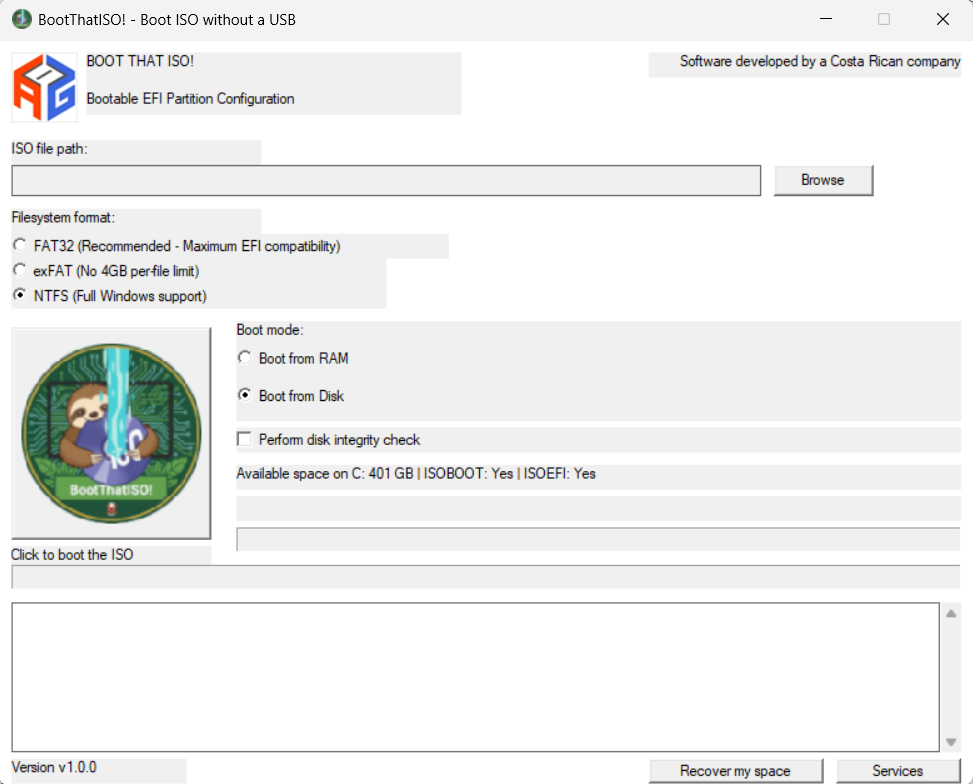

## Requisitos del Sistema

- Windows 10 u 11 de 64 bits con privilegios de administrador.
- PowerShell, DiskPart, bcdedit y herramientas de linea de comandos de Windows disponibles en el sistema.
- Espacio libre minimo de 12 GB en la unidad C: para crear y formatear particiones.

## Descarga
Descarga el ejecutable desde los assets adjuntos.

## Mejoras Recientes

- **Enlazado Estático del Runtime**: El ejecutable ahora está enlazado estáticamente con el runtime de C++ y MFC, eliminando la dependencia de DLLs externas como MSVCP140.dll. Esto hace que el programa sea completamente autónomo y no requiera la instalación del Visual C++ Redistributable.

## What's Changed
* UI Fixes by @tiirwaa in https://github.com/tiirwaa/BootThatISO-WITHOUT-USB---NO-USB-NEEDED-/pull/1
* screenshot by @tiirwaa in https://github.com/tiirwaa/BootThatISO-WITHOUT-USB---NO-USB-NEEDED-/pull/2
* Add cache-busting parameters to image URLs in README by @tiirwaa in https://github.com/tiirwaa/BootThatISO-WITHOUT-USB---NO-USB-NEEDED-/pull/3
* signed exe by @tiirwaa in https://github.com/tiirwaa/BootThatISO-WITHOUT-USB---NO-USB-NEEDED-/pull/4

## New Contributors
* @tiirwaa made their first contribution in https://github.com/tiirwaa/BootThatISO-WITHOUT-USB---NO-USB-NEEDED-/pull/1

**Full Changelog**: https://github.com/tiirwaa/BootThatISO-WITHOUT-USB---NO-USB-NEEDED-/commits/v1.0.0
